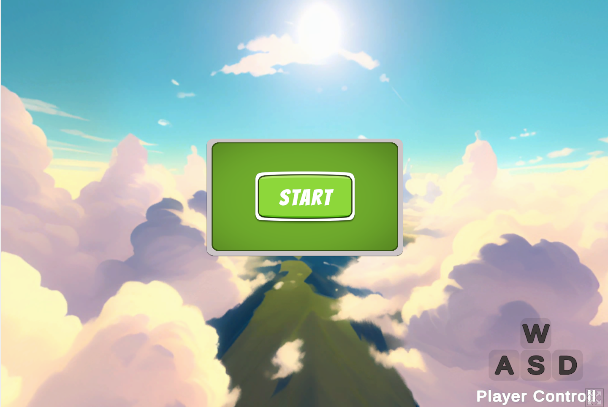
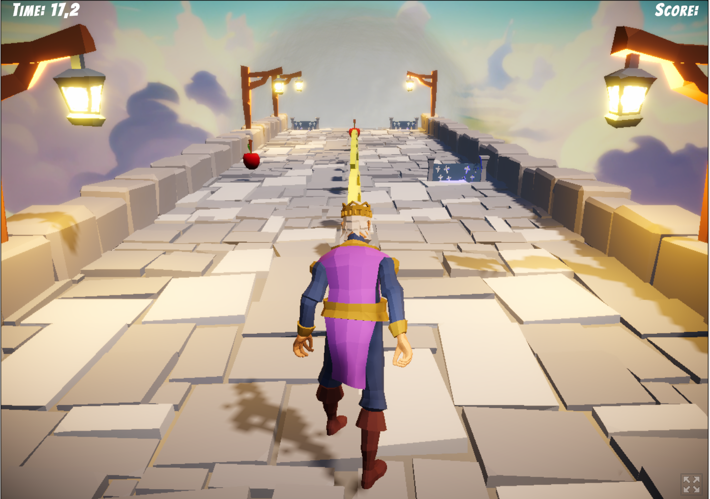
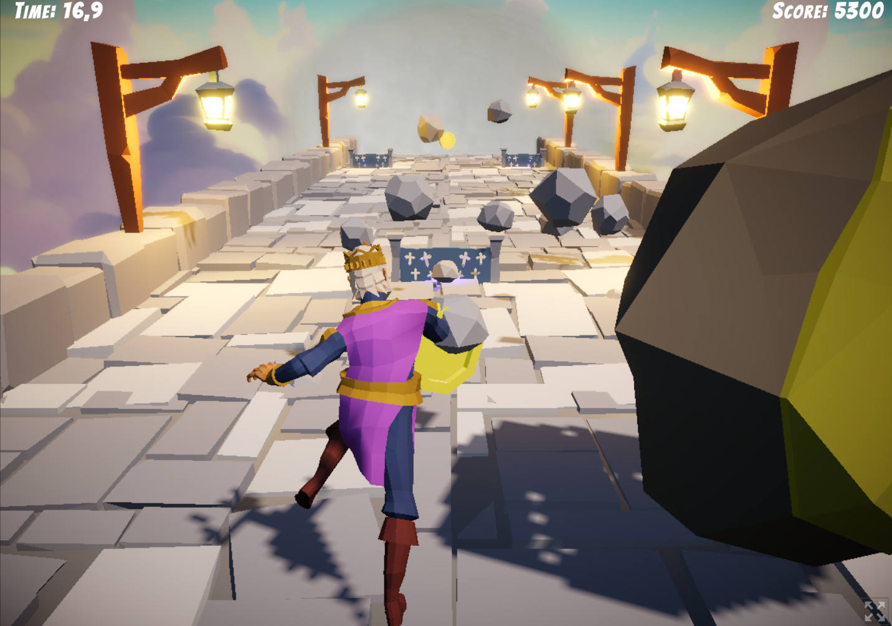

# 🏃‍♂️ Royal Run  
A small hyper-casual endless runner made in Unity.  
The player moves through a continuously generated corridor filled with obstacles, falling objects and collectibles.  
A compact gameplay loop focused on smooth movement, timing and quick reactions.

---

## 🎮 Gameplay Overview  
The character automatically runs forward while the level is generated ahead.  
The goal is to stay alive, maintain the timer and collect items to increase the score.

### Core Mechanics  
- **Endless Movement:** continuous forward motion with infinite generation.  
- **Obstacles:** barrels, chairs, rocks, carts and other objects that can slow or stop the player.  
- **Falling Objects:** random reaction-based hazards.  
- **Collectibles:**  
  - **Apples** — increase speed and restore time.  
  - **Coins** — add to score.  
- **Timer System:** constantly decreases but can be restored by apples and checkpoints.  
- **Player Reactions:**  
  - run animation  
  - stumble animation when hitting obstacles (visual feedback only)  
- **Camera Shake & VFX:** shake on impact, speed-up particles.  
- **Audio & UI:** footsteps, pickups, impact sounds, light HUD.  
- **Post-processing:** bloom, color grading, subtle polish.

---

## 🧠 Tech & Structure  
- Unity  
- C#  
- Procedural environment generation  
- Simple object pooling  
- Animator-driven player reactions  
- Trigger-based collectibles  
- Timer and score logic  
- Lightweight post-processing

---

## 📂 Project Structure
```
/Assets
    /Animations
    /Audio
    /Prefabs
    /Scripts
        /Player
        /Environment
        /Obstacles
        /Collectibles
        /UI
    /Materials
    /Scenes
```

## 📸 Screenshots

### 🟢 Start Screen
<p align="center"></p>

### 🍎 Collecting Apples (Speed Boost)
<p align="center"></p>

### 😂 Just a fun moment
<p align="center"></p>

---

## 👨‍💻 Developer  
**Oleksandr Tokarev** — Unity & C# Game Developer based in Finland.  
A small practice project made to explore endless-runner mechanics and procedural environment setups.

